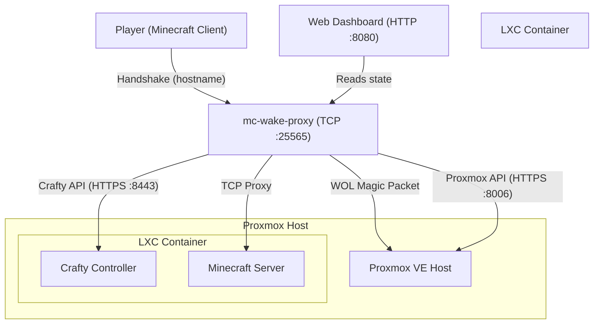

# mc-wake-proxy

A **wake-on-demand** TCP proxy for Minecraft servers running inside a Proxmox LXC, managed by Crafty Controller.

When a player tries to connect to an offline backend, `mc-wake-proxy`:

1. Sends a **Wake-on-LAN** magic packet to the Proxmox host.
2. Polls the **Proxmox VE API** to check if the LXC is running, and starts it if not.
3. Sends a **start_server** command via the **Crafty Controller API**.
4. Waits for the Minecraft server to accept connections, then **transparently proxies** the player's bytes.

During the entire process, players see friendly MOTD/kick messages ("🟡 Waking host…", "🟡 Starting Minecraft…") instead of timeouts.

A **web dashboard** (:8080) shows the current wake phase, time elapsed, and live logs.

---

## Architecture



### Phase machine

```
IDLE ──(player connects)──▶ WAKING_HOST ──(host reachable)──▶ WAITING_LXC
                                                                    │
                                                           (LXC running)
                                                                    ▼
                                                              STARTING_MC
                                                                    │
                                                          (backend reachable)
                                                                    ▼
                                                                 READY
```

Each phase is shown on the dashboard with elapsed time. If the chain fails to complete within `COOLDOWN_MINUTES`, the proxy returns to IDLE.

---

## Quick Start

### 1. Clone

```bash
git clone https://github.com/mefrraz/mc-wake-proxy.git
cd mc-wake-proxy
```

### 2. Configure environment

Copy the environment block from `docker-compose.yml` and replace every `<REPLACE_ME>` with your actual values. See the inline comments for each variable.

Minimal required variables:

| Variable | Description |
|---|---|
| `WOL_MAC` | MAC address of the Proxmox host's physical interface |
| `WOL_BROADCAST` | IPv4 broadcast address (e.g. `192.168.1.255`) |
| `BACKEND_TARGET` | `IP:port` of the Minecraft server inside the LXC |
| `PROXMOX_HOST` | Proxmox hostname or IP |
| `PROXMOX_NODE` | Proxmox node name (e.g. `pve`) |
| `PROXMOX_LXC_ID` | LXC container ID |
| `PROXMOX_TOKEN_ID` | API token ID (`user@realm!tokenname`) |
| `PROXMOX_TOKEN_SECRET` | API token secret (UUID) |
| `CRAFTY_HOST` | IP of the LXC running Crafty |
| `CRAFTY_TOKEN` | Crafty API token |
| `CRAFTY_SERVER_ID` | Crafty server UUID to manage |

### 3. Run

```bash
docker compose up -d
```

Or build and run directly:

```bash
docker build -t mc-wake-proxy .
docker run --network host \
  -e WOL_MAC=... \
  -e WOL_BROADCAST=... \
  ... \
  mc-wake-proxy
```

---

## Setup Guides

- **[docs/proxmox-setup.md](docs/proxmox-setup.md)** — Create a Proxmox API token with minimum privileges.
- **[docs/crafty-setup.md](docs/crafty-setup.md)** — Generate a Crafty API token and find your `server_id`.
- **[docs/deploy.md](docs/deploy.md)** — Deploy to Raspberry Pi (git clone, scp, buildx).
- **[docs/multi-server.md](docs/multi-server.md)** — Future multi-server configuration format.

---

## Exposing to the Internet

### DuckDNS + Port Forwarding

1. Register a free subdomain at [duckdns.org](https://duckdns.org).
2. Install the DuckDNS update client on your Raspberry Pi (or configure your router if it supports dynamic DNS natively).
3. On your router, forward **TCP port 25565** to the Raspberry Pi's local IP.
4. Players connect using `your-subdomain.duckdns.org`.

> **Important**: Minecraft traffic is **raw TCP**, not HTTP. Do NOT route it through Nginx Proxy Manager or any HTTP reverse proxy — those only work for HTTP/HTTPS. The Minecraft port must go directly to the Pi.

### Dashboard access (optional)

If you want remote access to the dashboard (`:8080`), you can:
- Expose it through NPM as a regular HTTP domain (the dashboard IS HTTP), OR
- Use a VPN / Tailscale for secure access.

---

## Development

### Building

```bash
go build ./cmd/proxy/
```

### Tests

```bash
go test ./...
```

### Cross-compile for Raspberry Pi

```bash
GOOS=linux GOARCH=arm64 go build -o mc-wake-proxy ./cmd/proxy/
```

---

## License

MIT — see [LICENSE](LICENSE).

---

## Roadmap

See [docs/roadmap.md](docs/roadmap.md).
