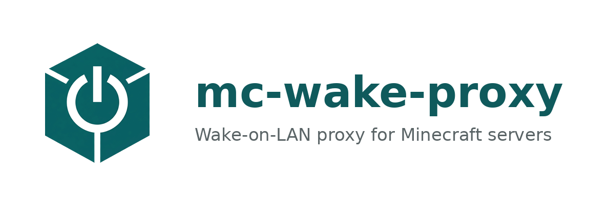
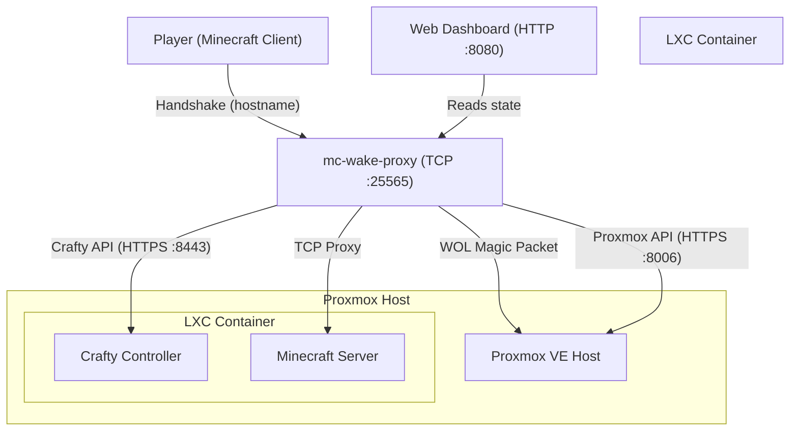

# mc-wake-proxy

<p align="center"></p>

A **wake-on-demand** TCP proxy for Minecraft servers running inside a Proxmox LXC, managed by Crafty Controller.

When a player connects to an offline backend, `mc-wake-proxy` sends a Wake-on-LAN packet, starts the LXC via Proxmox API, launches the Minecraft server via Crafty Controller, and transparently proxies the connection — all while showing friendly status messages.

**v2.4 — Multi-server, dashboard-managed, with console, discover, and secure login.**

---

## Features

- **Smart wake chain** — WOL → Proxmox → LXC → Crafty → Minecraft, skips steps already done
- **Multi-server routing** — hostname-based (`survival.mc.example.com` → backend A, `creative.mc.example.com` → backend B)
- **Web dashboard** — 4 tabs: Dashboard, Servers (per-server detail), Logs, Settings
- **Server management** — Add/Remove servers via UI, Discover & import from Crafty Controller
- **Console** — Send commands to Minecraft servers from the dashboard
- **Stop / Restart** — Per-server actions via Crafty API
- **Auto-shutdown** — Stop idle servers after N minutes of zero players
- **Phase-aware MOTD** — Players see "Offline", "Starting...", "Shutting down...", or "Ready"
- **Server icon** — Drop a `server-icon.png` for the Minecraft server list
- **Secure login** — Optional `PROXY_PASSWORD` with session cookie
- **Health checks** — Proxmox, Crafty, WOL, Backend validated at startup with diagnostic hints
- **DuckDNS wizard** — Suggested subdomains on the Settings page
- **ARM + x86** — Multi-arch Docker image

---

## Architecture



---

## Quick Start

### 1. Clone

```bash
git clone https://github.com/mefrraz/mc-wake-proxy.git
cd mc-wake-proxy
```

### 2. Configure

Copy `.env.example` to `.env` and fill in your values:

```bash
cp .env.example .env
nano .env
```

Required variables: `WOL_MAC`, `WOL_BROADCAST`, `PROXMOX_HOST`, `PROXMOX_NODE`, `PROXMOX_LXC_ID`, `PROXMOX_TOKEN_ID`, `PROXMOX_TOKEN_SECRET`, `CRAFTY_HOST`, `CRAFTY_TOKEN`.

Optional: `PROXY_LANG=pt`, `AUTO_SHUTDOWN_MINUTES=15`, `PROXY_PASSWORD=yourpassword`.

### 3. Run

```bash
docker compose up -d
```

- Dashboard: `http://<pi-ip>:8080`
- Minecraft: `<pi-ip>:25565`

---

## Multi-server setup

Once running, open the **Settings** tab on the dashboard:

1. Click **Discover** to find servers from Crafty
2. Click **Import** on a server, enter its hostname
3. The server appears instantly — no restart needed

Servers are stored in `servers.yml` (managed by the dashboard — no manual editing).

---

## Dashboard

| Tab | Content |
|---|---|
| **Dashboard** | Phase, elapsed time, health indicators, server cards with start/stop/restart |
| **Servers** | Server list, click for detail: info, actions, console, server logs |
| **Logs** | Global event log with copy button |
| **Settings** | Add server, discover from Crafty, manage servers, DuckDNS suggestions |

---

## Setup Guides

- **[docs/proxmox-setup.md](docs/proxmox-setup.md)** — Create a Proxmox API token
- **[docs/crafty-setup.md](docs/crafty-setup.md)** — Crafty API token and server ID
- **[docs/deploy.md](docs/deploy.md)** — Deploy to Raspberry Pi
- **[docs/multi-server.md](docs/multi-server.md)** — Multi-server configuration details

---

## Exposing to the Internet

1. Register a free subdomain at [duckdns.org](https://duckdns.org)
2. Forward **TCP port 25565** to the Raspberry Pi
3. Minecraft traffic is raw TCP — do NOT route through Nginx Proxy Manager

Secure the dashboard with `PROXY_PASSWORD` if exposing it remotely.

---

## Development

```bash
go build ./cmd/proxy/    # Build
go test ./...            # 42 tests
GOOS=linux GOARCH=arm64 go build -o mc-wake-proxy ./cmd/proxy/  # Cross-compile for Pi
```

---

## License

MIT — see [LICENSE](LICENSE).
